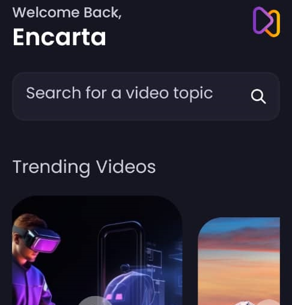

<a name="readme-top"></a>

<div align="center">

 <!-- LOGO -->

  
  <br/>

<!-- MAIN HEADING -->

  <h3><b>Aora</b></h3>

</div>

<!-- TABLE OF CONTENTS -->
# 📗 Table of Contents

- [📖 About the Project](#about-project)
  - [🛠 Built With](#built-with)
    - [Tech Stack](#tech-stack)
    - [Key Features](#key-features)
- [🚀 Live Demo](#live-demo)
- [💻 Getting Started](#getting-started)
  - [Setup](#setup)
  - [Prerequisites](#prerequisites)
  - [Install](#install)
  - [Usage](#usage)
  - [Run tests](#run-tests)
  - [Deployment](#deployment)
- [👥 Authors](#authors)
- [🔭 Future Features](#future-features)
- [🤝 Contributing](#contributing)
- [⭐️ Show your support](#support)
- [🙏 Acknowledgements](#acknowledgements)
- [❓ FAQ (OPTIONAL)](#faq)
- [📝 License](#license)

<!-- INTRO -->
# 📖 Job-it<a name="about-project"></a>

> Aora is a mobile app for sharing AI generated videos. Authenticated users could create, save, search, and bookmark videos. It was built with React, React Native, Expo, and Appwrite.

It was built with React

## 🛠 Built With <a name="built-with"></a>
1. React
2. React Native
3. Expo
4. Appwrite

### Tech Stack <a name="tech-stack"></a>

<details>
  <summary>Client</summary>
  <ul>
    <li><a href="https://reactjs.org/">React</a></li>
    <li><a href="https://reactnative.dev/">React Native</a></li>
    <li><a href="https://expo.dev/">Expo</a></li>
    <li><a href="https://appwrite.io/">Appwrite</a></li>
  </ul>
</details>

<!-- Features -->

### Key Features <a name="key-features"></a>

> - Create posts with AI generated videos
> - Search videos
> - Save and Bookmark videos
> - Playback videos

<p align="right">(<a href="#readme-top">back to top</a>)</p>

<!-- LIVE DEMO -->

LIVE DEMO

> Live page coming soon

<p align="right">(<a href="#readme-top">back to top</a>)</p>

<!-- GETTING STARTED -->

## 💻 Getting Started <a name="getting-started"></a>

> To get a local copy of the project, use this link:
> 
```sh
cd aora
https://github.com/anyars-encarta/Aora.git
```

<!-- SETUP -->
### Setup

To setup this project, run this command:

```sh
npm install
```
### Prerequisites

1. A Browser (Preferably Google Chrome)
2. A Code Editor
3. Internet Connection
4. Git

<!-- INSTALL -->
### Install

Install this project with Iroko.

### Usage

To run the project, execute the following command:

```sh
npx expo start -c
```
Then scan the QR Code with your phone. Ensure to install Expo Go on your phone.

### Run tests
To test the project, execute the following command:
```sh
npm run test
```
### Deployment

You can deploy this project using:
> 1. Expo CLI

<p align="right">(<a href="#readme-top">back to top</a>)</p>

<!-- AUTHORS -->
## 👥 Authors <a name="authors"></a>

👤 **Anyars Yussif**

- GitHub: [@anyars-encarta](https://github.com/anyars-encarta)
- Twitter: [@anyarsencarta](https://twitter.com/anyarsencarta)
- LinkedIn: [LinkedIn](https://www.linkedin.com/in/anyars-yussif/)


<p align="right">(<a href="#readme-top">back to top</a>)</p>

## 🔭 Future Features <a name="future-features"></a>

- [ ] **Work on Save to bookmark**
- [ ] **Work on liking videos**
- [ ] **Work on adding comments to videos**

<p align="right">(<a href="#readme-top">back to top</a>)</p>

<!-- CONTRIBUTION -->
## 🤝 Contributing <a name="contributing"></a>

Contributions, issues, and feature requests are welcome!

<p align="right">(<a href="#readme-top">back to top</a>)</p>

<!--SUPPORT -->

## ⭐️ Show your support <a name="support"></a>

> If you like this project, please give it some starts ⭐️⭐️⭐️⭐️⭐️

<p align="right">(<a href="#readme-top">back to top</a>)</p>

<!-- ACKNOWLEDGEMENTS -->
## 🙏 Acknowledgments <a name="acknowledgements"></a>

> Special credit to [adrianhajdin](https://github.com/adrianhajdin) and [microverseinc](https://github.com/microverseinc) for the linters conguration and materials.

<p align="right">(<a href="#readme-top">back to top</a>)</p>

<!-- FAQS -->
## ❓ FAQ (OPTIONAL) <a name="faq"></a>

- **How were the React and Linters utilised?**

  - The React and Linters were utilised with the help of resources provided by [@microverseinc](https://github.com/microverseinc).

- **What new features should be expected in the next release of the project?**

  - I am currently working on saving to bookmark, liking videos, and adding comments to videos.

<p align="right">(<a href="#readme-top">back to top</a>)</p>

<!-- LICENSE -->

## 📝 License <a name="license"></a>

This project is [MIT](./LICENSE) licensed.

<p align="right">(<a href="#readme-top">back to top</a>)</p>
